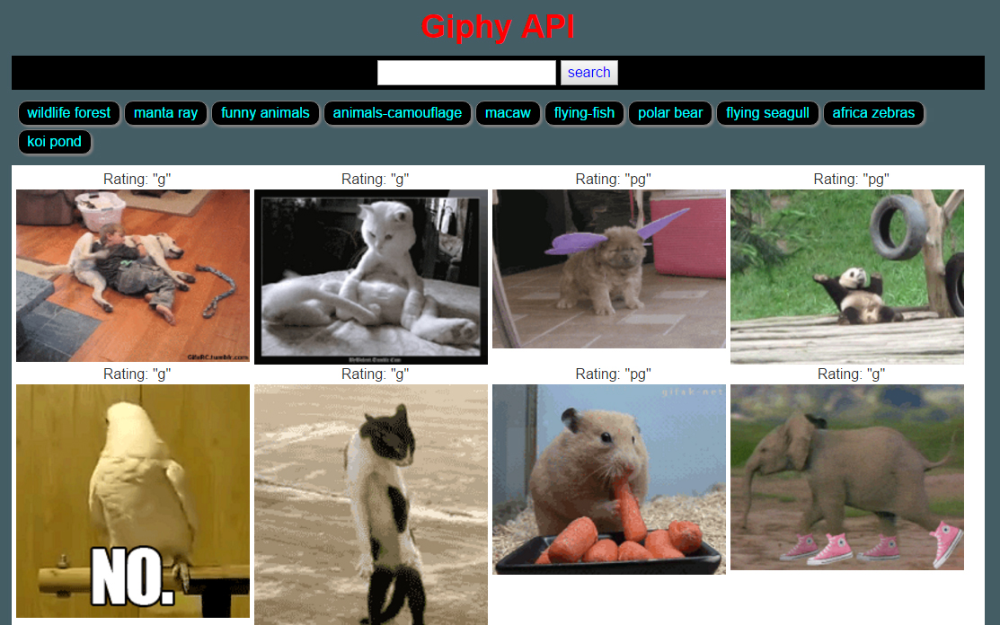

# HW6---Giphy-API

## Instructions
Instructions are [here](./homework.md) (better with a [video](video/homework_demo.mov))

## User Interface

----------------------------------------------

## Aim
Use the **GIPHY API** to make a dynamic web page that populates with gifs of your choice. To finish this task, you must call the **GIPHY API** and use **JavaScript** and **jQuery** to change the HTML of your site.

## Excecution
Click the file "**index.html**" to start the application.